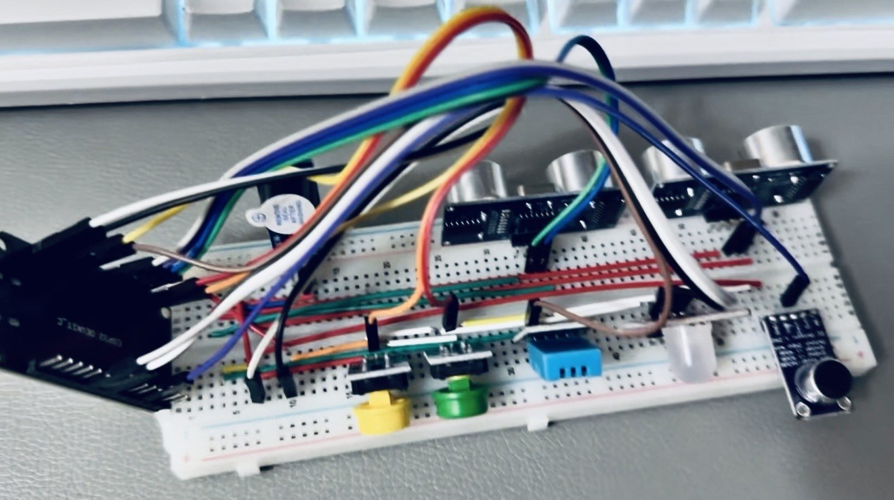

# 基于ESP32的婴儿状态监测原型

> 面向 ESP32、传感器采集与局域网 HTTP 学习的软硬件原型。它读取两路 HC-SR04 距离、DHT11 温湿度和模拟声音输入，并把**演示级信号分类**显示在 RGB LED / 蜂鸣器上；配置 Wi-Fi 后可在可信局域网读取本地 JSON。

[](https://github.com/rongyishuaige7/esp32-baby-monitor/actions/workflows/validate.yml)
[](LICENSE)

> [!CAUTION]
> 这是本科嵌入式学习原型，不是婴儿安全监护、睡眠安全、哭声识别、姿态识别、医疗、生命体征、紧急告警或无人值守看护设备。距离组合、声音幅度、温湿度、LED、蜂鸣器、串口和 HTTP 响应都**不能**证明婴儿姿态、状态、安全、风险、告警送达或有人正在看护。不得将它用于婴儿看护、医疗、睡眠安全、紧急响应或任何生命安全场景。

## 项目照片与资料

这里整理了项目照片、界面截图和相关资料；文件处理说明见 [MEDIA_EVIDENCE](docs/MEDIA_EVIDENCE.md)。



## 系统范围

```text
两路 HC-SR04 距离 + DHT11 温湿度 + 模拟声音输入
  → ESP32 中的固定阈值 / 距离组合演示分类
  → RGB LED 与蜂鸣器的本地提示
  → 可选：可信局域网内的无认证 HTTP JSON
```

- **距离输入：** 两路 HC-SR04 的距离组合只会产生未经标定的 `reference_pattern`、`side_pattern`、`ambiguous`、`near_threshold` 或 `unknown` 分类；它们不是人体姿态识别结果。
- **环境与声音：** 温湿度和模拟声音的固定数值阈值，只驱动演示级 `reference` / `attention` / `high_threshold` / `unknown` 信号等级；不是医学、儿科、睡眠或安全标准。
- **本地反馈：** LED 与蜂鸣器只表示程序当前的演示级分类。`/api/mute` 只切换蜂鸣器，不是告警确认、远程控制或安全处置。
- **网络：** 只有提供本地 `wifi_credentials.h` 后，固件才尝试连接 2.4 GHz Wi-Fi 并启动 HTTP 服务；未配置或连接失败时，传感器循环仍可运行，但 HTTP 不会启动。

## 硬件与电气边界

| 模块/信号 | ESP32 引脚 | 当前边界 |
| :-- | :-- | :-- |
| HC-SR04 #1 | TRIG GPIO5 / ECHO GPIO18 | 源码定义；ECHO 常为 5 V，接入 ESP32 前必须做合适分压/电平转换 |
| HC-SR04 #2 | TRIG GPIO19 / ECHO GPIO21 | 源码定义；同样必须确认 ECHO 电平与公共地 |
| DHT11 DATA | GPIO4 | 源码通过 Adafruit DHT 库读取；模块电压、上拉与时序须按实物确认 |
| 模拟声音 AO | GPIO34 | 仅接受不超过 ESP32 ADC 允许范围的模拟电压；模块型号和标定未知 |
| RGB LED | R GPIO25 / G GPIO27 / B GPIO26 | 当前代码按低电平点亮的接法输出；共阳/共阴、限流与实际接线待确认 |
| 蜂鸣器 | GPIO2 | 当前代码按低电平触发处理；需按实物确认驱动、电流和是否需三极管/MOSFET |
| 两个按钮 | GPIO22 / GPIO23 | 当前代码期待按下为高电平；必须提供稳定外部上拉/下拉，不能让 GPIO 悬空 |

完整的 [BOM](hardware/BOM.csv)、[源码推导接线边界图](hardware/wiring-diagram.svg)和[硬件说明](HARDWARE.md)都不等于原理图、PCB、已验证接线或真机复测证据。首次接线、改线或烧录前请断电，确认电压、电流、电平、限流、供电能力和公共地。不要把 5 V 信号直接接入 ESP32 GPIO，也不要用 GPIO 直接驱动超出额定电流的负载。

## 本地构建与固件配置

### 1. 获取代码并安装 PlatformIO

```bash
git clone https://github.com/rongyishuaige7/esp32-baby-monitor.git
cd esp32-baby-monitor
python3 -m pip install 'platformio==6.1.19'
```

该项目固定 `espressif32@6.13.0` 和直接依赖版本。构建会下载 ESP32 Arduino 框架与上游库；它不烧录任何设备。

### 2. 可选：本地 Wi-Fi 凭据

```bash
cp src/wifi_credentials.example.h src/wifi_credentials.h
# 只在本机编辑 wifi_credentials.h，填入自己的 2.4 GHz Wi-Fi 名称和密码
```

`src/wifi_credentials.h` 被 Git 忽略，不能提交、截图、粘贴到 Issue 或写进日志。保留为空时，固件会明确跳过 Wi-Fi 与 HTTP 服务，而不是使用默认密码或开放热点。

### 3. 仅构建

```bash
pio run
```

### 4. 在受控真机上烧录（尚未按当前提交验证）

确认板型、端口、供电和接线后，才可运行：

```bash
pio run -t upload
pio device monitor --baud 115200
```

这两个命令会操作已连接的硬件；它们不是 CI 的一部分。首次真机复测的最小记录见[验证说明](docs/VERIFICATION.md)。

### 5. 一键公开门禁

```bash
bash scripts/verify.sh
```

脚本运行公开边界检查、硬件无关源码契约和 PlatformIO 构建，完成后删除 `.pio/` 构建输出。它不烧录 ESP32、不读取真实传感器、不连接真实 Wi-Fi，也不证明蜂鸣器、LED 或 HTTP 在真机上工作。

## 本地 HTTP API（可选）

配置凭据、成功连接后，串口会输出本机局域网地址。服务没有 TLS、认证、访问控制、速率限制、审计或设备身份校验；**只能**在隔离且可信的教学局域网中使用，不能暴露到公网。

| 方法 | 路径 | 真实语义 |
| :-- | :-- | :-- |
| `GET` | `/api/status` | 返回本次程序读取到的原始数值、演示级距离分类与信号等级；不代表实时监护、健康、姿态、安全或设备在线 |
| `POST` | `/api/mute` | 切换本机蜂鸣器静音状态；不代表已处理、已通知、已确认安全或远程控制成功 |

字段含义、示例和网络限制见[协议说明](docs/PROTOCOL.md)。特别是 `reference`、`attention`、`high_threshold`、`unknown` 只是代码中的本地提示等级；它们没有安全优先级或医疗含义。

## 公开范围与来源

- 公开候选从桌面原工程的**当前工作区**隔离复制；原目录及其Git 记录保持不写入。
- 原工程HEAD 为 `4d108b2167c81b242632230526ac38b52364bcb5`。公开前工作区相对该 HEAD 存在源码、配置和 README 差异；当前工作区被裁决为发布候选，HEAD 仅作为可审计基线。
- 候选移除了未使用的本地 DHT11 包装层，重写了安全/姿态/哭声强结论、Wi-Fi 凭据路径和 HTTP 响应语义，并补充公开净化、文档、BOM、接线边界、门禁与 CI。
- 仓库不包含真实 Wi-Fi 凭据、`.pio/` 构建输出、固件二进制、IDE 状态、Android App 源码、实物照片、视频、EDA、PCB、Gerber、制造文件或真机日志。

详细差异和公开边界见[来源说明](docs/SOURCE_PROVENANCE.md)。缺少照片、视频或 App 源码不阻断当前源码开源，但不能被包装成已公开或可复现的能力。

## 开源许可与第三方组件

本仓自有源码和文档以 [MIT License](LICENSE) 发布。ESP32 Arduino 框架、ArduinoJson、Adafruit DHT sensor library 与 Adafruit Unified Sensor 由 PlatformIO 在构建时获取，不作为本仓源代码再分发；其来源和许可证入口见[第三方声明](THIRD_PARTY_NOTICES.md)。

## 安全与责任边界

凭据、网络暴露、数据最小化、传感器/状态语义和不适用场景见[安全说明](SECURITY.md)。报告问题时，请勿公开 SSID、密码、私网 IP、日志、儿童影像、音频、姓名、家庭地址、健康信息或其他个人数据。
